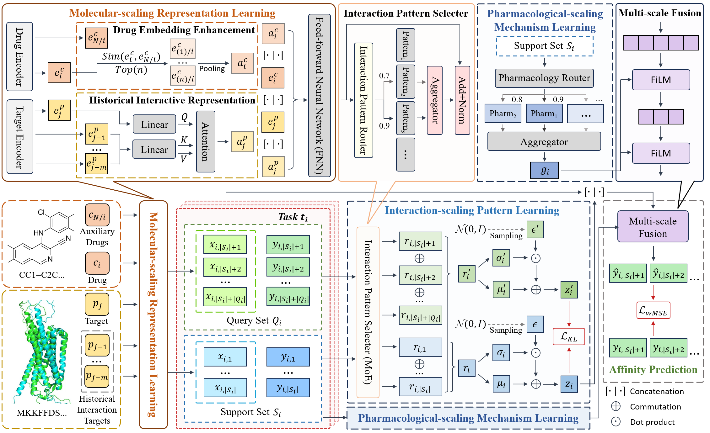

# Neural Adaptive Process with Multi-Scaling Intermolecular Dynamics for Few-Shot Drug-Target Affinity

## 1. Introduction

This repository contains source code and datasets for "Neural Adaptive Process with Multi-Scaling Intermolecular Dynamics for Few-Shot Drug-Target Affinity". 

In this study, we propose a neural adaptive process for few-shot DTA prediction, which is a probabilisic meta-learning architecture with multi-scale intermolecular dynamics, including molecular-scaling representation learning, interaction-scaling pattern learning, and pharmacological-scaling mechanism learning.

## 2. Overview



Fig1. Framework of NPDTA. The proposed framework comprises four integrated modules: Molecular-scaling Representation Learning (MRL) encodes auxiliary drugs, historical interaction targets, and drug-target pairs into embeddings, fusing auxiliary representations with original embeddings to enhance molecular representation; Interaction-scaling Pattern Learning (IPL) employs MoE to derive interaction pattern representations from drug-target pairs; Pharmacological-scaling Adaptive Learning (PML) extracts pharmacological representations from a prototype bank to modulate prediction network parameters in Affinity Prediction (AP); and AP concatenates molecular and interaction pattern representations for affinity estimation, optimized via an exponential-weighted MSE to prioritize high-affinity pairs.

## 3. Install Python libraries needed

```bash
$ conda create -n npdta_env python=3.8
$ conda activate npdta_env
$ pip install -r requirements.txt
```

## 4. Basic Usage

### (1) dataset
The relevant data required by the model are uniformly placed in the "data" folder. This folder contains the following three data folders and two data files:
<li><b>training</b>, <b>validation</b> and <b>testing</b>: These three folders all contain two folders, "log" and "evidence". The two folders are mirror images, the former is text data, and the latter is a binary file. Each file corresponds to the support set or query set of a task.
<li><b>drug_similarity_training.pkl</b> and <b>drug_similarity_testing.pkl</b>: These two files store the similarities between drugs and are used to quickly determine auxiliary drugs. 

### (2) main code
The python script file of the model is shown in this project, including the following files:
<li><b>drug_aux.py</b>: Computes drug similarity matrices.
<li><b>helper.py</b>: Provides utility functions.
<li><b>loader.py</b>: Loads and preprocesses data, generating training/validation/testing sets.
<li><b>sort.py</b>: Sorts interaction data based on affinity scores.
<li><b>embeddings_NPDTA.py</b>: Defines neural network modules.
<li><b>eval.py</b>: Implements evaluation metrics and model testing logic for regression performance.
<li><b>NPDTA_mse.py</b>: Core implementation of NPDTA.
<li><b>NPDTA_training_multi.py</b>: Training and testing-related programs.
<li><b>train_NPDTA_multi.py</b>: Run the entire program.

### (3) result
After running the "train_NPDTA_multi.py" file, the performance results of the model on the testing set can be obtained. 
The result file "result.txt" contains the results of each training and the average and standard deviation of multiple training results.
